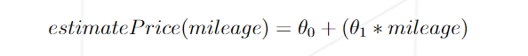
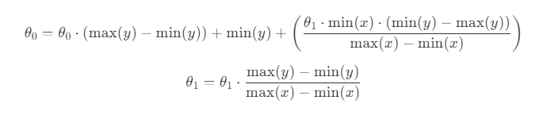

<br>

<div align="center"> 
    
    <br>
</div>

<br>

# ft_linear_regression

Introduction to machine learning project provided by the Artificial Intelligence branch of the 42 Network.

## Content table
- [About the project](#about-the-project)
- [How to use](#how-to-use)
- [Training algorithm](#train-the-model)
- [Estimate price](#estimate-price)
- [Data Normalization](#data-normalization)
- [Thetas Denormalization](#denormalize-the-thetas)
- [More](#more)

<hr>

## About the project

The main goal of this project is to implement by using linear regression the price of a car given its mileage.

To do this, we need to develop two programs. One of them is responsible for predicting the car's price based on its mileage, and the other is tasked with training the model to effectively adjust the parameters needed for the first program to predict the price.

I decided to create a third program to enhance the user experience. This third program works as a launcher, allowing you to interact with the different programs and execute them through a user-friendly interface.

Disclaimer: Both main programs can be executed individually. Feel free to run them as you see :D

<hr>

## How to use

#### Create and executing the virtual environment:

```
    python3 -m venv linear_env
    source linear_env/bin/activate
```

#### Install the requirements:

```
    pip3 install -r requirements.txt
```

#### Execute the launcher:

```
    python3 ft_linear_regression.py
```

#### Execute the training program individually:

```
    python3 train.py
```

#### Execute the predict program individually:

```
    python3 estimatePrice.py
```

<hr>

## Training Algorithm

To train the model and correctly solve the problem, we will implement the gradient descent algorithm. This algorithm is widely used in the fields of machine learning, data science, and mathematics to minimize the prediction error.

<br>

<div align="center"> 
    
    <br>
</div>

<br>

### Gradient Descent

The gradient descent algorithm is a method used to optimize a function. This function is usually a cost function that measures how poorly the model is performing in predicting the data.

#### How does gradient descent do that?

The algorithm uses a type of parameters called thetas to adjust the model and minimize the error between the model's predictions and the actual values.

In this use case of gradient descent, I needed to calculate and adjust two different thetas ( θ ), Theta0 and Theta1. For each one, I implemented the following formulas:

<br>

<div align="center"> 
    
    <br>
</div>

<br>

The objective here is to iteratively go through all the data until the error between the estimated price and the original price is sufficiently low. Once the difference is acceptably low, the theta values should be saved, and the loop should be terminated.

<hr>

## Estimate Price

You will need to use a simple lineal function to predict the price given a mileage

<br>

<div align="center"> 
    
    <br>
</div>

<br>

Where, theta0 and theta1 are the same calculated before.

<hr>

## Data Normalization

Data normalization refers to the process of adjusting the values numeric in a dataset to a common scale, without distorting differences in the ranges of values.

#### Why you should normalize the data?

1. <b>Improves Convergence:</b> Normalizing data can improve the convergence speed of gradient descent algorithms, making training faster and more reliable.
2. <b>Prevents Dominance:</b> Prevents features with larger scales from dominating those with smaller scales, which could otherwise skew the results.
3. <b>Easier to represent:</b> If you want to represent your data in a graphic, it is easier to visualize the data when it is normalized.

Once you understand this, I highly recommend normalizing the data in your dataset between 0 and 1, where 0 represents the minimum value and 1 represents the maximum value. I have done this with the price and mileage data.

<hr>

## Denormalize the thetas

Once you have your model trained, you will encounter a problem. If you have trained the thetas with numbers between 0 and 1, when you ask for a car with a mileage of 100,000 km, the price will not be accurate.

To solve this, you will need to denormalize the Thetas by applying the following two formulas:

<br>

<div align="center"> 
    
    <br>
</div>

<br>

<hr>

## More

If you want to know more about me, the project, or the 42 Network, feel free to contact me here or through my LinkedIn profile, which you can find on my GitHub page.

Have fun!