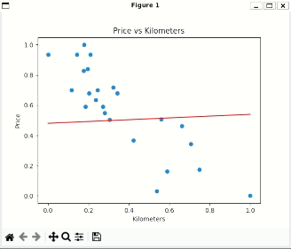

 

 
    
     

 

# ft_linear_regression

Introduction to machine learning project provided by the Artificial Intelligence branch of the 42 Network.

## About the project

The main goal of this project is to implement by using linear regression the price of a car given its mileage.

To do this, we need to develop two programs. One of them is responsible for predicting the car's price based on its mileage, and the other is tasked with training the model to effectively adjust the parameters needed for the first program to predict the price.

## The algorithm

To train the model and correctly solve the problem, we will implement the gradient descent algorithm. This algorithm is widely used in the fields of machine learning, data science, and mathematics to minimize the prediction error.

 

 
    
     

 

### Gradient descent

The gradient descent algorithm is a method used to optimize a function. This function is usually a cost function that measures how poorly the model is performing in predicting the data.

#### How does gradient descent do that?

The algorithm uses a type of parameters called thetas to adjust the model and minimize the error between the model's predictions and the actual values.

In this use case of gradient descent, I needed to calculate and adjust two different thetas ( θ ), Theta0 and Theta1. For each one, I implemented the following formulas:
 

 
    
     

 

The objective here is to iteratively go through all the data until the error between the estimated price and the original price is sufficiently low. Once the difference is acceptably low, the theta values should be saved, and the loop should be terminated.